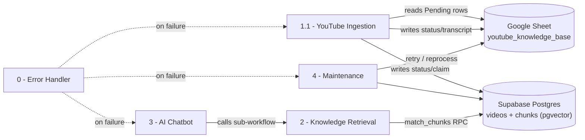

# YouTube AI Knowledge Base — n8n Workflow System

A production n8n automation system that ingests YouTube video transcripts, embeds them into a vector store, and serves a grounded, cited chatbot over that knowledge base. Built on n8n Cloud, Supabase (Postgres + pgvector), Google Sheets (operational queue/log), Apify (transcript scraping), and Google Gemini (embeddings + chat).

## Architecture



| # | Workflow | Trigger | Role |
|---|---|---|---|
| 0 | Error Handler | Error Trigger | Catches stop-level failures from other workflows, emails an alert |
| 1.1 | YouTube Ingestion | Schedule (15 min) | Reads pending video URLs, fetches transcripts, chunks + embeds, writes results |
| 2 | Knowledge Retrieval | Sub-workflow (called) | Embeds a question, runs vector search, returns ranked chunks |
| 3 | AI Chatbot | Chat Trigger | User-facing chat; calls Workflow 2, grounds answer in retrieved chunks with citations |
| 4 | Maintenance | Schedule (daily, 3 AM) | Retries failures, reprocesses stale videos, refreshes low-confidence embeddings, dedupes, cleans orphans |

Workflow 1.1 supersedes the original Workflow 1 (single-tier Apify-only ingestion). It is a redesign addressing seven issues found in review: overlapping-run races, missing duplicate detection, silent malformed-URL processing, no cost-saving free transcript tier, no reconciliation between attempted vs. inserted chunks, stale documentation, and an unverified chunks uniqueness constraint.

---

## Workflow 0 — Error Handler

Generic `errorTrigger` → email notification (`prasad_pankaj@hotmail.com`) via Gmail. Attached via each workflow's **Settings → Error Workflow**. Currently wired to Workflows 3 and 4; **Workflow 1.1 must have this set manually** (n8n's workflow-level settings aren't exposed through the automation tooling used to build these workflows, so this one field requires a one-time manual step in the UI).

## Workflow 1.1 — YouTube Ingestion

**Trigger:** Schedule, every 15 minutes (deliberately widened from an earlier 1-minute testing value; matches realistic per-video processing time).

**Pipeline, in order:**

1. **Read Pending Videos** — Google Sheets rows where `Transcript Status = Pending`.
2. **Extract Video ID** — regex extraction from `youtube.com/watch?v=`, `youtu.be/`, or `/shorts/` URLs, with a negative-lookahead boundary check so it doesn't silently truncate malformed slugs into a false-positive 11-character ID.
3. **Valid Video ID?** — routes structurally invalid URLs straight to a `Failed: Invalid or unsupported URL` status. (Note: this can only catch malformed *URLs* — a syntactically valid but non-existent 11-character ID will pass this check and only fail later, once transcript fetching comes up empty.)
4. **Claim Video for Processing** — a single atomic `INSERT ... ON CONFLICT (video_id) DO UPDATE ... WHERE videos.status IN ('pending','failed') RETURNING id` against Postgres. This one query both claims the video (flips status to `processing`) and performs duplicate detection — if the row is already `processing` or `embedded`, no row is returned and the item routes to the skip branch.
5. **Was Claimed? → Skip branch** — for already-processed/in-flight duplicates. A Postgres join (`videos` + `chunks`) backfills `Video Title`, `Transcript Source`, `Chunk Count`, and full `Transcript` text from the existing record, so a skipped row reads as complete in the sheet rather than partially blank.
6. **Transcript waterfall (2-tier):**
   - **Tier 1 — YouTube timedtext** (free): `GET /api/timedtext?lang=en&v={id}`. In practice this endpoint has proven unreliable for unauthenticated calls even on videos confirmed to have captions — most videos currently fall through to tier 2. This is a known, unresolved limitation (see Known Issues).
   - **Tier 2 — Apify actor** (paid fallback): only invoked when tier 1 returns no captions. `enableAiFallback: false` — no Whisper transcription fallback inside Apify.
7. **Transcript Obtained?** — routes to success or failure handling.
   - **Success:** clean/parse transcript → chunk (500-token target, 15% overlap, timestamp-aware) → embed each chunk via `gemini-embedding-001` (768-dim) → insert into `chunks` with `ON CONFLICT (video_id, chunk_index) DO NOTHING RETURNING id, chunk_index` → reconcile attempted-vs-inserted chunk counts (`Embedded` or `Partially Embedded (x/y)`) → update `videos` row and sheet.
   - **Failure:** `Failed: No transcript available` — both tiers exhausted.
8. Loop back via `Process Each Video` (splitInBatches, batch size 1) until all pending rows are processed.

**Key implementation notes:**
- `videos.id` is a **UUID**, not an integer — all downstream references treat it as a string.
- Postgres and HTTP Request nodes replace `$json` entirely with their own output (no `RETURNING`/response data means the rest of the item is lost) — every node after one of these that needs upstream data uses an explicit `$('Node Name')` reference rather than bare `$json`.
- `chunks` requires a unique constraint on `(video_id, chunk_index)` for the `ON CONFLICT` clause to have a target — verify with:
  ```sql
  SELECT conname FROM pg_constraint WHERE conrelid = 'chunks'::regclass AND contype = 'u';
  ```

## Workflow 2 — Knowledge Retrieval

Sub-workflow, called by Workflow 3. Embeds the incoming question (same `gemini-embedding-001` model as ingestion — embedding model must match between ingestion and retrieval for vector comparisons to be meaningful), runs a `match_chunks()` Postgres RPC (cosine similarity over `chunks.embedding`, joined to `videos` for title/URL context), returns ranked chunks. No changes required for the 1.1 redesign — reads the same schema ingestion writes.

## Workflow 3 — AI Chatbot

Chat Trigger → calls Workflow 2 → grounded Gemini Flash-Lite prompt → cited answer referencing source video(s). No changes required for the 1.1 redesign.

## Workflow 4 — Maintenance

**Trigger:** Schedule, daily at 3 AM. Five independent branches off one trigger:

1. **Retry failed videos** — find sheet rows with `Transcript Status` starting with `Failed`, reset to `Pending`, write back to the sheet.
2. **Reprocess stale videos** — find Postgres `videos` rows `status = 'embedded'` and `updated_at` older than 90 days; reset **both** the Postgres status to `pending` and the sheet status to `Pending` (the sheet-only reset was insufficient on its own — Workflow 1.1's claim step only reclaims rows with Postgres status `pending`/`failed`, so a stale-but-still-`embedded` row would otherwise be silently skipped every time).
3. **Refresh low-confidence Whisper embeddings** — chunks sourced from Apify's Whisper fallback, older than 30 days, re-embedded via `gemini-embedding-001` @ 768 dimensions (must match ingestion's model exactly).
4. **Dedupe chunks** — removes duplicate `(video_id, chunk_index)` rows.
5. **Clean orphans + stuck rows** — deletes chunks whose video no longer exists; resets `videos.status = 'failed'` for any row stuck at `status = 'processing'` for more than 2 hours (crash/timeout recovery).

**Important operational note — sheet matching:** both `Write Retry Status` and `Write Stale Status` match rows by **`Video URL`**, not `Video ID`. `Video ID` can be legitimately blank (a row that failed URL validation never had an ID extracted), and Google Sheets' `appendOrUpdate` batches all items into a single API call — one blank match-column value in the batch fails the *entire* batch with `"Column to Match On parameter is required"`, silently updating nothing while still reporting success. `Video URL` is guaranteed non-blank for every row, avoiding this failure mode. This also means **`Video URL` must stay unique across the sheet** — duplicate-URL rows (an artifact of manual testing) will cause ambiguous matches; keep one row per video.

---

## Data model

**`videos`** (Postgres, Supabase)
| Column | Notes |
|---|---|
| `id` | UUID, primary key |
| `video_id` | YouTube's 11-character ID, unique |
| `url` | Original submitted URL |
| `title`, `channel_name`, `duration_seconds` | Metadata (oEmbed / Apify) |
| `transcript_source` | `timedtext` \| `apify-caption` \| `apify-whisper` |
| `status` | `pending` → `processing` → `embedded` \| `partially_embedded` \| `failed` |
| `updated_at` | Used for stale/stuck-row detection |

**`chunks`** (Postgres, Supabase)
| Column | Notes |
|---|---|
| `id` | Primary key |
| `video_id` | FK → `videos.id` |
| `chunk_index`, `content`, `start_seconds`, `end_seconds`, `token_count`, `embedding` | Unique constraint required on `(video_id, chunk_index)` |

**Google Sheet** (`youtube_knowledge_base.csv`) — operational queue and human-readable log. Columns: `Video URL`, `Video Title`, `Transcript Status`, `Transcript`, `Process Date`, `Video ID`, `Transcript Source`, `Chunk Count`, `Error Message`.

## Credentials required

| Credential | Used by |
|---|---|
| Google Sheets OAuth2 | Workflows 1.1, 4 |
| Supabase Postgres | Workflows 1.1, 2, 4 |
| Apify API token | Workflow 1.1 (transcript actor) |
| Gemini API key | Workflows 1.1, 2, 3, 4 (embeddings + chat) |
| Gmail | Workflow 0 |

## Known issues / open items

- **Timedtext tier reliability unconfirmed at scale.** The free tier 1 transcript fetch has returned blank responses even for videos with confirmed captions during testing. Real hit-rate data (via the `transcript_source` field) should be reviewed before assuming it delivers meaningful cost savings; it may need a two-step track-list lookup or may not be viable as implemented.
- **No true retry cap.** Workflow 4's "Only Failed, Under Retry Limit" filter checks status text only — there's no retry counter, so a permanently broken entry (e.g. a non-existent video ID) will retry indefinitely, once per day, forever. A retry-count column and cap would close this gap.
- **Sheet row hygiene.** Both `Video URL` and `Video ID` should remain unique per row for reliable matching across Workflows 1.1 and 4. Testing has occasionally introduced duplicate rows for the same video — worth a periodic manual check.
